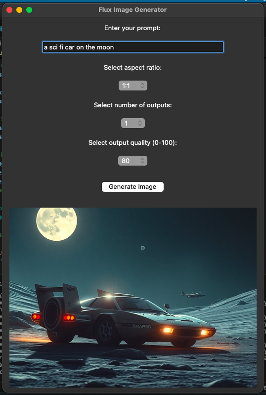

# Image Generator

This Image Generator is a Python application that allows users to generate images using the `flux-schnell` model from Replicate's API. The tool provides a GUI for setting prompts, aspect ratios, output quantity, and quality, and then displays generated images within the application.



## Features

- **Prompt-based Image Generation:** Users can enter text prompts to generate unique images.
- **Aspect Ratio Selection:** Allows users to choose between different aspect ratios for image output.
- **Output Quantity and Quality Settings:** Options to set the number of images to generate and adjust image quality from 0 to 100.
- **Image Display and Save:** Generated images are displayed within the GUI and saved locally.

## Prerequisites

Ensure you have the following installed:

- **Python**: Version 3.6+
- **Replicate API Access**: Sign up at [Replicate](https://replicate.com/) and obtain an API token.
- **Additional Python Libraries**:
  - `requests`
  - `Pillow`
  - `dotenv`
  - `tkinter`

Install any missing packages via pip:

```bash
pip install replicate requests pillow python-dotenv
>>>>>>> daa07b7ec0adbb91667cbd95938cc74261d9329d
